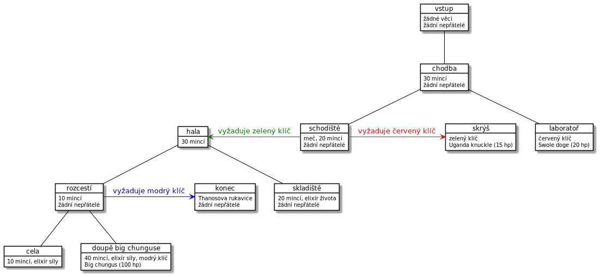
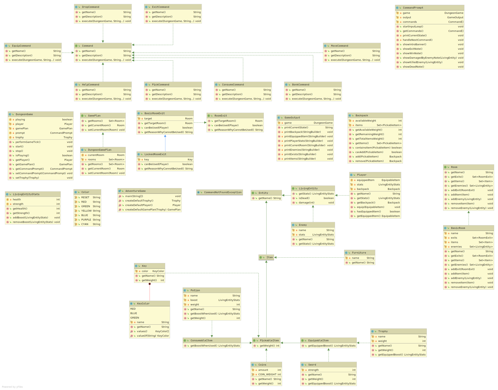
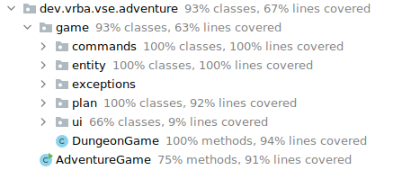

# Dungeon hra
Semestrální práce z předmětu 4IT101 - Programování v Javě

Svět se dostal do nepříznivé situace, jelikož Big chungus ukradl Thanosovi jeho rukavici a
chystá se zničit polovinu populace! Úkolem hráče je Big chunguse najít, vzít mu rukavici
a obléct si jí, aby zachránil svět před polozkázou.

## Herní plán

Pro průchod mezi mísnostmi, které jsou barevně označeny, je vyžadováno mít klíč specifikované barvy v batohu.
Kontrola probíhá v `game.plan.LockedRoomExit::canUse` kde se kontroluje přítomnost
předmětu přes `Backpack::containsItem`.

## Příkazy

Příkazy, které může hráč použít jsou `bonkni`, `vypij`, `jdi`, `polož`, `vezmi`, `konec`,
`nápověda`, `seber`.

Každý příkaz je implementací rozhraní `game.commands.Command` a rozhodovací
logika probíhá v implementované metodě `Command::execute`. Každý příkaz je následně potřeba
zaregistrovat v třídě `CommandPrompt`.

Pro zobrazení výčtu příkazů s popisem u každého z nich je možné použít příkaz `nápověda`, která
iterativně projde všechny příkazy a zobrazí výstup jejich implementace `Command::getDescription`.

## Architektura projektu

Projekt je členěn do balíčků (java packages) primárně podle jejich hiearchie a zařazení.

Kořenovým balíčkem je `dev.vrba.vse.adventure`, který je shodný s kořenovým balíčkem unit testů.

Většina logiky hry je implementovaná v balíčcích `commands`, `entity` a `plan`.
Grafický výstup a přijímání příkazů od uživatele  pak pouze v balíčku `ui`.

U některých tříd (např. `BasicRoom`, `BasicRoomExit`) je API extrahováno do obecného rozhraní, pro
lepší rozšířitelnost a snazší úpravy v budoucnu.

### Diagram tříd

## Strojové testy

V projektu jsou unit i "integrační" testy, umístěné ve složce `src/test` a snaží se cílit na 100% pokrytí
aplikační logiky (test coverage), kromě balíčku `ui`, který je z většiny testován ručně

Hra momentálně obsahuje 38 strojových testů a je možné je všechny najednou zavolat pomocí nástroje maven:
`mvn verify`.

Pro testování je využíváno JUnit API `jupiter`, které využívá anotací `@Test` a volání statických metod třídy
`org.junit.jupiter.api.Assertions`.