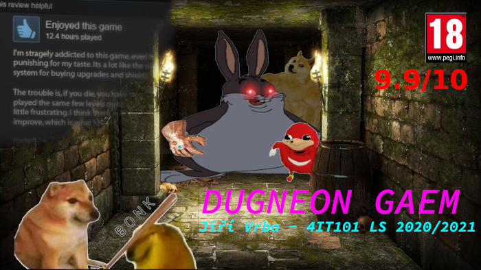

# Dungeon hra
Semestrální práce z předmětu 4IT101 - Programování v Javě

Svět se dostal do nepříznivé situace, jelikož Big chungus ukradl Thanosovi jeho rukavici a
chystá se zničit polovinu populace! Úkolem hráče je Big chunguse najít, vzít mu rukavici
a obléct si jí, aby zachránil svět před polozkázou.

## Cíl hry 

Cílem hry je porazit Big chunguse a získat předmět **Thanosova rukavice** a následně ho vzít do ruky za 
pomocí příkazu `vezmi`. K tomu je potřeba nejdříve Big chunguse najít a porazit.

## Herní plán

(obrázek herního plánu záměrně vynechán, aby nezkazil požitek ze hry)

Hráč začíná v místnosti pojmenované **vstup**. Během procházení dungeonem může sbírat
předměty do maximální váhy **100** a jeho počáteční vlastnosti jsou: **síla: 10**, **životy: 50**.

Tyto vlastnosti je možné vylepšit pomocí předmětů v dungeonu.

## Dostupné příkazy

Příkazy, které může hráč použít jsou `bonkni`, `vypij`, `jdi`, `polož`, `vezmi`, `konec`,
`nápověda`, `seber`.

Pro zobrazení výčtu příkazů s popisem u každého z nich je možné použít příkaz `nápověda`.

## Pohyb na mapě

Mezi místnostmi je možné se pohybovat pomocí příkazu `jdi`, který jako parametr příjímá název místnosti, do které
se hráč chce přesunout. Některé východy z místnosti mohou být zamčené a vyžadovat např. vlastnit klíč nebo jiný předmět.

## Nepřátelé

V dungeonu se nachází několik nepřátel, které je nutné porazit. Pokud hráč narazí na místnost, ve které se nachází
nepřátelé, není možné ji opustit, dokud nejsou všichni nepřátelé poraženi. Nepřátelé na začátku každého tahu
zaútočí na hráče a ubere mu počet životů podle své síly. Aby hráč zaútočil na nepřítele, je možné použít příkaz
`bonkni`, který jako parametr přijímá jméno nepřítele.

## Předměty

V některých místnostech na mapě je možné sebrat předměty, které zvyšují schopnosti. Každý předmět má 
určitou váhu. Hráč má batoh co má maximální nosnost 100, tj. není do něj možné vložit předměty
jejichž váha sečtená s věcmi, které již v batohu jsou by překročila tuto nosnost.

Předměty je možné dávat do batohu pomocí příkazu `seber` a vyhazovat je pomocí příkazu `polož`.

### Předměty, které je možné vzít do ruky

Tyto předměty jsou vyznačeny fialovou barvou a je možné je vzít pomocí příkazu `vezmi`.

### Předměty, které je možné vypít

Tyto předměty jsou vyznačený zelenou barvou a je možné je vypít pomocí příkazu `vypij`.